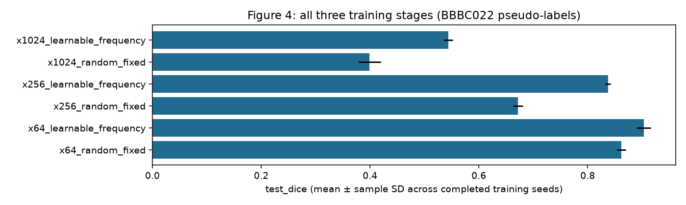

# Fresh campaign results

21/48 planned jobs are verified complete. Missing jobs are listed in coverage.csv.

[Per-seed metrics](metrics_by_seed.csv) · [Aggregates](aggregate.csv) · [Paper coverage](coverage.csv)

BBBC022 substitutes for the missing original U2OS confocal data. Segmentation uses generated pseudo-labels. The paper workflow retains the documented soft-mask recipes and budgets; it is distinct from the optional binary/equal-dose controlled stage. Code checks do not establish numerical reproduction or a preferred method ranking.

Figure 9's primary panel uses nonoverlapping acquisitions. Its overlap diagnostic reports additional measurements.

## Comparisons

## Completed job artifacts

- `segmentation/x64_random_fixed_seed42`: [artifacts and configuration](../jobs/segmentation/x64_random_fixed_seed42/attempt_001/)
- `segmentation/x64_learnable_frequency_seed42`: [artifacts and configuration](../jobs/segmentation/x64_learnable_frequency_seed42/attempt_001/)
- `segmentation/x256_random_fixed_seed42`: [artifacts and configuration](../jobs/segmentation/x256_random_fixed_seed42/attempt_001/)
- `segmentation/x256_learnable_frequency_seed42`: [artifacts and configuration](../jobs/segmentation/x256_learnable_frequency_seed42/attempt_001/)
- `segmentation/x1024_random_fixed_seed42`: [artifacts and configuration](../jobs/segmentation/x1024_random_fixed_seed42/attempt_001/)
- `segmentation/x1024_learnable_frequency_seed42`: [artifacts and configuration](../jobs/segmentation/x1024_learnable_frequency_seed42/attempt_001/)
- `segmentation/x64_random_fixed_seed43`: [artifacts and configuration](../jobs/segmentation/x64_random_fixed_seed43/attempt_001/)
- `segmentation/x64_learnable_frequency_seed43`: [artifacts and configuration](../jobs/segmentation/x64_learnable_frequency_seed43/attempt_001/)
- `segmentation/x256_random_fixed_seed43`: [artifacts and configuration](../jobs/segmentation/x256_random_fixed_seed43/attempt_001/)
- `segmentation/x256_learnable_frequency_seed43`: [artifacts and configuration](../jobs/segmentation/x256_learnable_frequency_seed43/attempt_001/)
- `segmentation/x1024_random_fixed_seed43`: [artifacts and configuration](../jobs/segmentation/x1024_random_fixed_seed43/attempt_001/)
- `segmentation/x1024_learnable_frequency_seed43`: [artifacts and configuration](../jobs/segmentation/x1024_learnable_frequency_seed43/attempt_001/)
- `segmentation/x64_random_fixed_seed44`: [artifacts and configuration](../jobs/segmentation/x64_random_fixed_seed44/attempt_001/)
- `segmentation/x64_learnable_frequency_seed44`: [artifacts and configuration](../jobs/segmentation/x64_learnable_frequency_seed44/attempt_001/)
- `segmentation/x256_random_fixed_seed44`: [artifacts and configuration](../jobs/segmentation/x256_random_fixed_seed44/attempt_001/)
- `segmentation/x256_learnable_frequency_seed44`: [artifacts and configuration](../jobs/segmentation/x256_learnable_frequency_seed44/attempt_001/)
- `segmentation/x1024_random_fixed_seed44`: [artifacts and configuration](../jobs/segmentation/x1024_random_fixed_seed44/attempt_001/)
- `segmentation/x1024_learnable_frequency_seed44`: [artifacts and configuration](../jobs/segmentation/x1024_learnable_frequency_seed44/attempt_001/)
- `sr/swinir_wo_li_seed42`: [artifacts and configuration](../jobs/sr/swinir_wo_li_seed42/attempt_001/)
- `sr/swinir_with_li_seed42`: [artifacts and configuration](../jobs/sr/swinir_with_li_seed42/attempt_001/)
- `sr/swinir_wo_li_seed43`: [artifacts and configuration](../jobs/sr/swinir_wo_li_seed43/attempt_001/)
