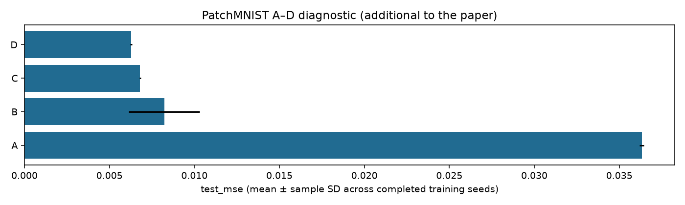
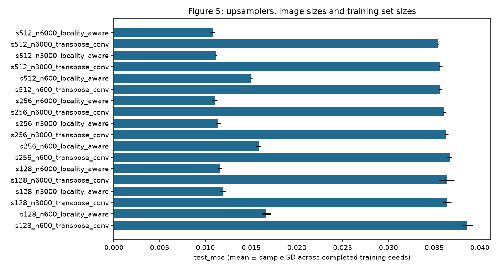
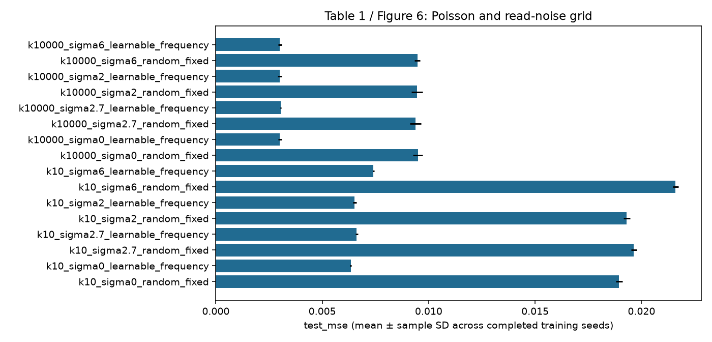
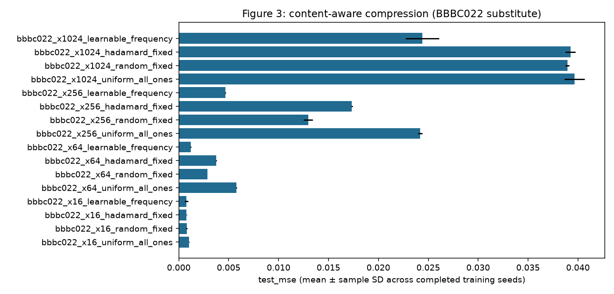

# Fresh campaign results

173/234 planned jobs are verified complete. Missing jobs are listed in coverage.csv.

[Per-seed metrics](metrics_by_seed.csv) · [Aggregates](aggregate.csv) · [Paper coverage](coverage.csv)

BBBC022 substitutes for the missing original U2OS confocal data. Segmentation uses generated pseudo-labels. The paper workflow retains the documented soft-mask recipes and budgets; it is distinct from the optional binary/equal-dose controlled stage. Code checks do not establish numerical reproduction or a preferred method ranking.

Figure 9's primary panel uses nonoverlapping acquisitions. Its overlap diagnostic reports additional measurements.

## Comparisons

## Completed job artifacts

- `patchmnist/A_seed42`: [artifacts and configuration](../jobs/patchmnist/A_seed42/attempt_001/)
- `patchmnist/B_seed42`: [artifacts and configuration](../jobs/patchmnist/B_seed42/attempt_001/)
- `patchmnist/C_seed42`: [artifacts and configuration](../jobs/patchmnist/C_seed42/attempt_001/)
- `patchmnist/D_seed42`: [artifacts and configuration](../jobs/patchmnist/D_seed42/attempt_001/)
- `patchmnist/A_seed43`: [artifacts and configuration](../jobs/patchmnist/A_seed43/attempt_001/)
- `patchmnist/B_seed43`: [artifacts and configuration](../jobs/patchmnist/B_seed43/attempt_001/)
- `patchmnist/C_seed43`: [artifacts and configuration](../jobs/patchmnist/C_seed43/attempt_001/)
- `patchmnist/D_seed43`: [artifacts and configuration](../jobs/patchmnist/D_seed43/attempt_001/)
- `patchmnist/A_seed44`: [artifacts and configuration](../jobs/patchmnist/A_seed44/attempt_001/)
- `patchmnist/B_seed44`: [artifacts and configuration](../jobs/patchmnist/B_seed44/attempt_001/)
- `patchmnist/C_seed44`: [artifacts and configuration](../jobs/patchmnist/C_seed44/attempt_001/)
- `patchmnist/D_seed44`: [artifacts and configuration](../jobs/patchmnist/D_seed44/attempt_001/)
- `upsampling/s128_n600_transpose_conv_seed42`: [artifacts and configuration](../jobs/upsampling/s128_n600_transpose_conv_seed42/attempt_001/)
- `upsampling/s128_n600_locality_aware_seed42`: [artifacts and configuration](../jobs/upsampling/s128_n600_locality_aware_seed42/attempt_001/)
- `upsampling/s128_n3000_transpose_conv_seed42`: [artifacts and configuration](../jobs/upsampling/s128_n3000_transpose_conv_seed42/attempt_001/)
- `upsampling/s128_n3000_locality_aware_seed42`: [artifacts and configuration](../jobs/upsampling/s128_n3000_locality_aware_seed42/attempt_001/)
- `upsampling/s128_n6000_transpose_conv_seed42`: [artifacts and configuration](../jobs/upsampling/s128_n6000_transpose_conv_seed42/attempt_001/)
- `upsampling/s128_n6000_locality_aware_seed42`: [artifacts and configuration](../jobs/upsampling/s128_n6000_locality_aware_seed42/attempt_001/)
- `upsampling/s256_n600_transpose_conv_seed42`: [artifacts and configuration](../jobs/upsampling/s256_n600_transpose_conv_seed42/attempt_001/)
- `upsampling/s256_n600_locality_aware_seed42`: [artifacts and configuration](../jobs/upsampling/s256_n600_locality_aware_seed42/attempt_001/)
- `upsampling/s256_n3000_transpose_conv_seed42`: [artifacts and configuration](../jobs/upsampling/s256_n3000_transpose_conv_seed42/attempt_001/)
- `upsampling/s256_n3000_locality_aware_seed42`: [artifacts and configuration](../jobs/upsampling/s256_n3000_locality_aware_seed42/attempt_001/)
- `upsampling/s256_n6000_transpose_conv_seed42`: [artifacts and configuration](../jobs/upsampling/s256_n6000_transpose_conv_seed42/attempt_001/)
- `upsampling/s256_n6000_locality_aware_seed42`: [artifacts and configuration](../jobs/upsampling/s256_n6000_locality_aware_seed42/attempt_001/)
- `upsampling/s512_n600_transpose_conv_seed42`: [artifacts and configuration](../jobs/upsampling/s512_n600_transpose_conv_seed42/attempt_001/)
- `upsampling/s512_n600_locality_aware_seed42`: [artifacts and configuration](../jobs/upsampling/s512_n600_locality_aware_seed42/attempt_002/)
- `upsampling/s512_n3000_transpose_conv_seed42`: [artifacts and configuration](../jobs/upsampling/s512_n3000_transpose_conv_seed42/attempt_002/)
- `upsampling/s512_n3000_locality_aware_seed42`: [artifacts and configuration](../jobs/upsampling/s512_n3000_locality_aware_seed42/attempt_001/)
- `upsampling/s512_n6000_transpose_conv_seed42`: [artifacts and configuration](../jobs/upsampling/s512_n6000_transpose_conv_seed42/attempt_001/)
- `upsampling/s512_n6000_locality_aware_seed42`: [artifacts and configuration](../jobs/upsampling/s512_n6000_locality_aware_seed42/attempt_001/)
- `upsampling/s128_n600_transpose_conv_seed43`: [artifacts and configuration](../jobs/upsampling/s128_n600_transpose_conv_seed43/attempt_001/)
- `upsampling/s128_n600_locality_aware_seed43`: [artifacts and configuration](../jobs/upsampling/s128_n600_locality_aware_seed43/attempt_001/)
- `upsampling/s128_n3000_transpose_conv_seed43`: [artifacts and configuration](../jobs/upsampling/s128_n3000_transpose_conv_seed43/attempt_001/)
- `upsampling/s128_n3000_locality_aware_seed43`: [artifacts and configuration](../jobs/upsampling/s128_n3000_locality_aware_seed43/attempt_001/)
- `upsampling/s128_n6000_transpose_conv_seed43`: [artifacts and configuration](../jobs/upsampling/s128_n6000_transpose_conv_seed43/attempt_001/)
- `upsampling/s128_n6000_locality_aware_seed43`: [artifacts and configuration](../jobs/upsampling/s128_n6000_locality_aware_seed43/attempt_001/)
- `upsampling/s256_n600_transpose_conv_seed43`: [artifacts and configuration](../jobs/upsampling/s256_n600_transpose_conv_seed43/attempt_001/)
- `upsampling/s256_n600_locality_aware_seed43`: [artifacts and configuration](../jobs/upsampling/s256_n600_locality_aware_seed43/attempt_001/)
- `upsampling/s256_n3000_transpose_conv_seed43`: [artifacts and configuration](../jobs/upsampling/s256_n3000_transpose_conv_seed43/attempt_001/)
- `upsampling/s256_n3000_locality_aware_seed43`: [artifacts and configuration](../jobs/upsampling/s256_n3000_locality_aware_seed43/attempt_001/)
- `upsampling/s256_n6000_transpose_conv_seed43`: [artifacts and configuration](../jobs/upsampling/s256_n6000_transpose_conv_seed43/attempt_001/)
- `upsampling/s256_n6000_locality_aware_seed43`: [artifacts and configuration](../jobs/upsampling/s256_n6000_locality_aware_seed43/attempt_001/)
- `upsampling/s512_n600_transpose_conv_seed43`: [artifacts and configuration](../jobs/upsampling/s512_n600_transpose_conv_seed43/attempt_001/)
- `upsampling/s512_n600_locality_aware_seed43`: [artifacts and configuration](../jobs/upsampling/s512_n600_locality_aware_seed43/attempt_001/)
- `upsampling/s512_n3000_transpose_conv_seed43`: [artifacts and configuration](../jobs/upsampling/s512_n3000_transpose_conv_seed43/attempt_001/)
- `upsampling/s512_n3000_locality_aware_seed43`: [artifacts and configuration](../jobs/upsampling/s512_n3000_locality_aware_seed43/attempt_001/)
- `upsampling/s512_n6000_transpose_conv_seed43`: [artifacts and configuration](../jobs/upsampling/s512_n6000_transpose_conv_seed43/attempt_001/)
- `upsampling/s512_n6000_locality_aware_seed43`: [artifacts and configuration](../jobs/upsampling/s512_n6000_locality_aware_seed43/attempt_001/)
- `upsampling/s128_n600_transpose_conv_seed44`: [artifacts and configuration](../jobs/upsampling/s128_n600_transpose_conv_seed44/attempt_001/)
- `upsampling/s128_n600_locality_aware_seed44`: [artifacts and configuration](../jobs/upsampling/s128_n600_locality_aware_seed44/attempt_001/)
- `upsampling/s128_n3000_transpose_conv_seed44`: [artifacts and configuration](../jobs/upsampling/s128_n3000_transpose_conv_seed44/attempt_001/)
- `upsampling/s128_n3000_locality_aware_seed44`: [artifacts and configuration](../jobs/upsampling/s128_n3000_locality_aware_seed44/attempt_001/)
- `upsampling/s128_n6000_transpose_conv_seed44`: [artifacts and configuration](../jobs/upsampling/s128_n6000_transpose_conv_seed44/attempt_001/)
- `upsampling/s128_n6000_locality_aware_seed44`: [artifacts and configuration](../jobs/upsampling/s128_n6000_locality_aware_seed44/attempt_001/)
- `upsampling/s256_n600_transpose_conv_seed44`: [artifacts and configuration](../jobs/upsampling/s256_n600_transpose_conv_seed44/attempt_001/)
- `upsampling/s256_n600_locality_aware_seed44`: [artifacts and configuration](../jobs/upsampling/s256_n600_locality_aware_seed44/attempt_001/)
- `upsampling/s256_n3000_transpose_conv_seed44`: [artifacts and configuration](../jobs/upsampling/s256_n3000_transpose_conv_seed44/attempt_001/)
- `upsampling/s256_n3000_locality_aware_seed44`: [artifacts and configuration](../jobs/upsampling/s256_n3000_locality_aware_seed44/attempt_001/)
- `upsampling/s256_n6000_transpose_conv_seed44`: [artifacts and configuration](../jobs/upsampling/s256_n6000_transpose_conv_seed44/attempt_001/)
- `upsampling/s256_n6000_locality_aware_seed44`: [artifacts and configuration](../jobs/upsampling/s256_n6000_locality_aware_seed44/attempt_001/)
- `upsampling/s512_n600_transpose_conv_seed44`: [artifacts and configuration](../jobs/upsampling/s512_n600_transpose_conv_seed44/attempt_001/)
- `upsampling/s512_n600_locality_aware_seed44`: [artifacts and configuration](../jobs/upsampling/s512_n600_locality_aware_seed44/attempt_001/)
- `upsampling/s512_n3000_transpose_conv_seed44`: [artifacts and configuration](../jobs/upsampling/s512_n3000_transpose_conv_seed44/attempt_001/)
- `upsampling/s512_n3000_locality_aware_seed44`: [artifacts and configuration](../jobs/upsampling/s512_n3000_locality_aware_seed44/attempt_001/)
- `upsampling/s512_n6000_transpose_conv_seed44`: [artifacts and configuration](../jobs/upsampling/s512_n6000_transpose_conv_seed44/attempt_001/)
- `upsampling/s512_n6000_locality_aware_seed44`: [artifacts and configuration](../jobs/upsampling/s512_n6000_locality_aware_seed44/attempt_001/)
- `noise/k10_sigma0_random_fixed_seed42`: [artifacts and configuration](../jobs/noise/k10_sigma0_random_fixed_seed42/attempt_001/)
- `noise/k10_sigma0_learnable_frequency_seed42`: [artifacts and configuration](../jobs/noise/k10_sigma0_learnable_frequency_seed42/attempt_001/)
- `noise/k10_sigma2.7_random_fixed_seed42`: [artifacts and configuration](../jobs/noise/k10_sigma2.7_random_fixed_seed42/attempt_001/)
- `noise/k10_sigma2.7_learnable_frequency_seed42`: [artifacts and configuration](../jobs/noise/k10_sigma2.7_learnable_frequency_seed42/attempt_001/)
- `noise/k10_sigma2_random_fixed_seed42`: [artifacts and configuration](../jobs/noise/k10_sigma2_random_fixed_seed42/attempt_001/)
- `noise/k10_sigma2_learnable_frequency_seed42`: [artifacts and configuration](../jobs/noise/k10_sigma2_learnable_frequency_seed42/attempt_001/)
- `noise/k10_sigma6_random_fixed_seed42`: [artifacts and configuration](../jobs/noise/k10_sigma6_random_fixed_seed42/attempt_001/)
- `noise/k10_sigma6_learnable_frequency_seed42`: [artifacts and configuration](../jobs/noise/k10_sigma6_learnable_frequency_seed42/attempt_001/)
- `noise/k10000_sigma0_random_fixed_seed42`: [artifacts and configuration](../jobs/noise/k10000_sigma0_random_fixed_seed42/attempt_001/)
- `noise/k10000_sigma0_learnable_frequency_seed42`: [artifacts and configuration](../jobs/noise/k10000_sigma0_learnable_frequency_seed42/attempt_001/)
- `noise/k10000_sigma2.7_random_fixed_seed42`: [artifacts and configuration](../jobs/noise/k10000_sigma2.7_random_fixed_seed42/attempt_001/)
- `noise/k10000_sigma2.7_learnable_frequency_seed42`: [artifacts and configuration](../jobs/noise/k10000_sigma2.7_learnable_frequency_seed42/attempt_001/)
- `noise/k10000_sigma2_random_fixed_seed42`: [artifacts and configuration](../jobs/noise/k10000_sigma2_random_fixed_seed42/attempt_001/)
- `noise/k10000_sigma2_learnable_frequency_seed42`: [artifacts and configuration](../jobs/noise/k10000_sigma2_learnable_frequency_seed42/attempt_001/)
- `noise/k10000_sigma6_random_fixed_seed42`: [artifacts and configuration](../jobs/noise/k10000_sigma6_random_fixed_seed42/attempt_001/)
- `noise/k10000_sigma6_learnable_frequency_seed42`: [artifacts and configuration](../jobs/noise/k10000_sigma6_learnable_frequency_seed42/attempt_001/)
- `noise/k10_sigma0_random_fixed_seed43`: [artifacts and configuration](../jobs/noise/k10_sigma0_random_fixed_seed43/attempt_001/)
- `noise/k10_sigma0_learnable_frequency_seed43`: [artifacts and configuration](../jobs/noise/k10_sigma0_learnable_frequency_seed43/attempt_001/)
- `noise/k10_sigma2.7_random_fixed_seed43`: [artifacts and configuration](../jobs/noise/k10_sigma2.7_random_fixed_seed43/attempt_001/)
- `noise/k10_sigma2.7_learnable_frequency_seed43`: [artifacts and configuration](../jobs/noise/k10_sigma2.7_learnable_frequency_seed43/attempt_001/)
- `noise/k10_sigma2_random_fixed_seed43`: [artifacts and configuration](../jobs/noise/k10_sigma2_random_fixed_seed43/attempt_001/)
- `noise/k10_sigma2_learnable_frequency_seed43`: [artifacts and configuration](../jobs/noise/k10_sigma2_learnable_frequency_seed43/attempt_001/)
- `noise/k10_sigma6_random_fixed_seed43`: [artifacts and configuration](../jobs/noise/k10_sigma6_random_fixed_seed43/attempt_001/)
- `noise/k10_sigma6_learnable_frequency_seed43`: [artifacts and configuration](../jobs/noise/k10_sigma6_learnable_frequency_seed43/attempt_001/)
- `noise/k10000_sigma0_random_fixed_seed43`: [artifacts and configuration](../jobs/noise/k10000_sigma0_random_fixed_seed43/attempt_001/)
- `noise/k10000_sigma0_learnable_frequency_seed43`: [artifacts and configuration](../jobs/noise/k10000_sigma0_learnable_frequency_seed43/attempt_001/)
- `noise/k10000_sigma2.7_random_fixed_seed43`: [artifacts and configuration](../jobs/noise/k10000_sigma2.7_random_fixed_seed43/attempt_001/)
- `noise/k10000_sigma2.7_learnable_frequency_seed43`: [artifacts and configuration](../jobs/noise/k10000_sigma2.7_learnable_frequency_seed43/attempt_001/)
- `noise/k10000_sigma2_random_fixed_seed43`: [artifacts and configuration](../jobs/noise/k10000_sigma2_random_fixed_seed43/attempt_001/)
- `noise/k10000_sigma2_learnable_frequency_seed43`: [artifacts and configuration](../jobs/noise/k10000_sigma2_learnable_frequency_seed43/attempt_001/)
- `noise/k10000_sigma6_random_fixed_seed43`: [artifacts and configuration](../jobs/noise/k10000_sigma6_random_fixed_seed43/attempt_001/)
- `noise/k10000_sigma6_learnable_frequency_seed43`: [artifacts and configuration](../jobs/noise/k10000_sigma6_learnable_frequency_seed43/attempt_001/)
- `noise/k10_sigma0_random_fixed_seed44`: [artifacts and configuration](../jobs/noise/k10_sigma0_random_fixed_seed44/attempt_001/)
- `noise/k10_sigma0_learnable_frequency_seed44`: [artifacts and configuration](../jobs/noise/k10_sigma0_learnable_frequency_seed44/attempt_001/)
- `noise/k10_sigma2.7_random_fixed_seed44`: [artifacts and configuration](../jobs/noise/k10_sigma2.7_random_fixed_seed44/attempt_001/)
- `noise/k10_sigma2.7_learnable_frequency_seed44`: [artifacts and configuration](../jobs/noise/k10_sigma2.7_learnable_frequency_seed44/attempt_001/)
- `noise/k10_sigma2_random_fixed_seed44`: [artifacts and configuration](../jobs/noise/k10_sigma2_random_fixed_seed44/attempt_001/)
- `noise/k10_sigma2_learnable_frequency_seed44`: [artifacts and configuration](../jobs/noise/k10_sigma2_learnable_frequency_seed44/attempt_001/)
- `noise/k10_sigma6_random_fixed_seed44`: [artifacts and configuration](../jobs/noise/k10_sigma6_random_fixed_seed44/attempt_001/)
- `noise/k10_sigma6_learnable_frequency_seed44`: [artifacts and configuration](../jobs/noise/k10_sigma6_learnable_frequency_seed44/attempt_001/)
- `noise/k10000_sigma0_random_fixed_seed44`: [artifacts and configuration](../jobs/noise/k10000_sigma0_random_fixed_seed44/attempt_001/)
- `noise/k10000_sigma0_learnable_frequency_seed44`: [artifacts and configuration](../jobs/noise/k10000_sigma0_learnable_frequency_seed44/attempt_001/)
- `noise/k10000_sigma2.7_random_fixed_seed44`: [artifacts and configuration](../jobs/noise/k10000_sigma2.7_random_fixed_seed44/attempt_001/)
- `noise/k10000_sigma2.7_learnable_frequency_seed44`: [artifacts and configuration](../jobs/noise/k10000_sigma2.7_learnable_frequency_seed44/attempt_001/)
- `noise/k10000_sigma2_random_fixed_seed44`: [artifacts and configuration](../jobs/noise/k10000_sigma2_random_fixed_seed44/attempt_001/)
- `noise/k10000_sigma2_learnable_frequency_seed44`: [artifacts and configuration](../jobs/noise/k10000_sigma2_learnable_frequency_seed44/attempt_001/)
- `noise/k10000_sigma6_random_fixed_seed44`: [artifacts and configuration](../jobs/noise/k10000_sigma6_random_fixed_seed44/attempt_001/)
- `noise/k10000_sigma6_learnable_frequency_seed44`: [artifacts and configuration](../jobs/noise/k10000_sigma6_learnable_frequency_seed44/attempt_001/)
- `content/bbbc022_x16_uniform_all_ones_seed42`: [artifacts and configuration](../jobs/content/bbbc022_x16_uniform_all_ones_seed42/attempt_001/)
- `content/bbbc022_x16_random_fixed_seed42`: [artifacts and configuration](../jobs/content/bbbc022_x16_random_fixed_seed42/attempt_001/)
- `content/bbbc022_x16_hadamard_fixed_seed42`: [artifacts and configuration](../jobs/content/bbbc022_x16_hadamard_fixed_seed42/attempt_001/)
- `content/bbbc022_x16_learnable_frequency_seed42`: [artifacts and configuration](../jobs/content/bbbc022_x16_learnable_frequency_seed42/attempt_001/)
- `content/bbbc022_x64_uniform_all_ones_seed42`: [artifacts and configuration](../jobs/content/bbbc022_x64_uniform_all_ones_seed42/attempt_001/)
- `content/bbbc022_x64_random_fixed_seed42`: [artifacts and configuration](../jobs/content/bbbc022_x64_random_fixed_seed42/attempt_001/)
- `content/bbbc022_x64_hadamard_fixed_seed42`: [artifacts and configuration](../jobs/content/bbbc022_x64_hadamard_fixed_seed42/attempt_001/)
- `content/bbbc022_x64_learnable_frequency_seed42`: [artifacts and configuration](../jobs/content/bbbc022_x64_learnable_frequency_seed42/attempt_001/)
- `content/bbbc022_x256_uniform_all_ones_seed42`: [artifacts and configuration](../jobs/content/bbbc022_x256_uniform_all_ones_seed42/attempt_001/)
- `content/bbbc022_x256_random_fixed_seed42`: [artifacts and configuration](../jobs/content/bbbc022_x256_random_fixed_seed42/attempt_001/)
- `content/bbbc022_x256_hadamard_fixed_seed42`: [artifacts and configuration](../jobs/content/bbbc022_x256_hadamard_fixed_seed42/attempt_001/)
- `content/bbbc022_x256_learnable_frequency_seed42`: [artifacts and configuration](../jobs/content/bbbc022_x256_learnable_frequency_seed42/attempt_001/)
- `content/bbbc022_x1024_uniform_all_ones_seed42`: [artifacts and configuration](../jobs/content/bbbc022_x1024_uniform_all_ones_seed42/attempt_001/)
- `content/bbbc022_x1024_random_fixed_seed42`: [artifacts and configuration](../jobs/content/bbbc022_x1024_random_fixed_seed42/attempt_001/)
- `content/bbbc022_x1024_hadamard_fixed_seed42`: [artifacts and configuration](../jobs/content/bbbc022_x1024_hadamard_fixed_seed42/attempt_001/)
- `content/bbbc022_x1024_learnable_frequency_seed42`: [artifacts and configuration](../jobs/content/bbbc022_x1024_learnable_frequency_seed42/attempt_001/)
- `content/bbbc022_x16_uniform_all_ones_seed43`: [artifacts and configuration](../jobs/content/bbbc022_x16_uniform_all_ones_seed43/attempt_001/)
- `content/bbbc022_x16_random_fixed_seed43`: [artifacts and configuration](../jobs/content/bbbc022_x16_random_fixed_seed43/attempt_001/)
- `content/bbbc022_x16_hadamard_fixed_seed43`: [artifacts and configuration](../jobs/content/bbbc022_x16_hadamard_fixed_seed43/attempt_001/)
- `content/bbbc022_x16_learnable_frequency_seed43`: [artifacts and configuration](../jobs/content/bbbc022_x16_learnable_frequency_seed43/attempt_002/)
- `content/bbbc022_x64_uniform_all_ones_seed43`: [artifacts and configuration](../jobs/content/bbbc022_x64_uniform_all_ones_seed43/attempt_001/)
- `content/bbbc022_x64_random_fixed_seed43`: [artifacts and configuration](../jobs/content/bbbc022_x64_random_fixed_seed43/attempt_001/)
- `content/bbbc022_x64_hadamard_fixed_seed43`: [artifacts and configuration](../jobs/content/bbbc022_x64_hadamard_fixed_seed43/attempt_001/)
- `content/bbbc022_x64_learnable_frequency_seed43`: [artifacts and configuration](../jobs/content/bbbc022_x64_learnable_frequency_seed43/attempt_001/)
- `content/bbbc022_x256_uniform_all_ones_seed43`: [artifacts and configuration](../jobs/content/bbbc022_x256_uniform_all_ones_seed43/attempt_001/)
- `content/bbbc022_x256_random_fixed_seed43`: [artifacts and configuration](../jobs/content/bbbc022_x256_random_fixed_seed43/attempt_001/)
- `content/bbbc022_x256_hadamard_fixed_seed43`: [artifacts and configuration](../jobs/content/bbbc022_x256_hadamard_fixed_seed43/attempt_001/)
- `content/bbbc022_x256_learnable_frequency_seed43`: [artifacts and configuration](../jobs/content/bbbc022_x256_learnable_frequency_seed43/attempt_001/)
- `content/bbbc022_x1024_uniform_all_ones_seed43`: [artifacts and configuration](../jobs/content/bbbc022_x1024_uniform_all_ones_seed43/attempt_001/)
- `content/bbbc022_x1024_random_fixed_seed43`: [artifacts and configuration](../jobs/content/bbbc022_x1024_random_fixed_seed43/attempt_001/)
- `content/bbbc022_x1024_hadamard_fixed_seed43`: [artifacts and configuration](../jobs/content/bbbc022_x1024_hadamard_fixed_seed43/attempt_001/)
- `content/bbbc022_x1024_learnable_frequency_seed43`: [artifacts and configuration](../jobs/content/bbbc022_x1024_learnable_frequency_seed43/attempt_001/)
- `content/bbbc022_x16_uniform_all_ones_seed44`: [artifacts and configuration](../jobs/content/bbbc022_x16_uniform_all_ones_seed44/attempt_001/)
- `content/bbbc022_x16_random_fixed_seed44`: [artifacts and configuration](../jobs/content/bbbc022_x16_random_fixed_seed44/attempt_001/)
- `content/bbbc022_x16_hadamard_fixed_seed44`: [artifacts and configuration](../jobs/content/bbbc022_x16_hadamard_fixed_seed44/attempt_001/)
- `content/bbbc022_x16_learnable_frequency_seed44`: [artifacts and configuration](../jobs/content/bbbc022_x16_learnable_frequency_seed44/attempt_001/)
- `content/bbbc022_x64_uniform_all_ones_seed44`: [artifacts and configuration](../jobs/content/bbbc022_x64_uniform_all_ones_seed44/attempt_001/)
- `content/bbbc022_x64_random_fixed_seed44`: [artifacts and configuration](../jobs/content/bbbc022_x64_random_fixed_seed44/attempt_001/)
- `content/bbbc022_x64_hadamard_fixed_seed44`: [artifacts and configuration](../jobs/content/bbbc022_x64_hadamard_fixed_seed44/attempt_001/)
- `content/bbbc022_x64_learnable_frequency_seed44`: [artifacts and configuration](../jobs/content/bbbc022_x64_learnable_frequency_seed44/attempt_001/)
- `content/bbbc022_x256_uniform_all_ones_seed44`: [artifacts and configuration](../jobs/content/bbbc022_x256_uniform_all_ones_seed44/attempt_001/)
- `content/bbbc022_x256_random_fixed_seed44`: [artifacts and configuration](../jobs/content/bbbc022_x256_random_fixed_seed44/attempt_001/)
- `content/bbbc022_x256_hadamard_fixed_seed44`: [artifacts and configuration](../jobs/content/bbbc022_x256_hadamard_fixed_seed44/attempt_001/)
- `content/bbbc022_x256_learnable_frequency_seed44`: [artifacts and configuration](../jobs/content/bbbc022_x256_learnable_frequency_seed44/attempt_001/)
- `content/bbbc022_x1024_uniform_all_ones_seed44`: [artifacts and configuration](../jobs/content/bbbc022_x1024_uniform_all_ones_seed44/attempt_001/)
- `content/bbbc022_x1024_random_fixed_seed44`: [artifacts and configuration](../jobs/content/bbbc022_x1024_random_fixed_seed44/attempt_001/)
- `content/bbbc022_x1024_hadamard_fixed_seed44`: [artifacts and configuration](../jobs/content/bbbc022_x1024_hadamard_fixed_seed44/attempt_001/)
- `content/bbbc022_x1024_learnable_frequency_seed44`: [artifacts and configuration](../jobs/content/bbbc022_x1024_learnable_frequency_seed44/attempt_001/)
- `content_swinir/x16_random_fixed_seed42`: [artifacts and configuration](../jobs/content_swinir/x16_random_fixed_seed42/attempt_001/)
- `content_swinir/x16_learnable_frequency_seed42`: [artifacts and configuration](../jobs/content_swinir/x16_learnable_frequency_seed42/attempt_001/)
- `content_swinir/x64_random_fixed_seed42`: [artifacts and configuration](../jobs/content_swinir/x64_random_fixed_seed42/attempt_001/)
- `content_swinir/x64_learnable_frequency_seed42`: [artifacts and configuration](../jobs/content_swinir/x64_learnable_frequency_seed42/attempt_001/)
- `content_swinir/x256_random_fixed_seed42`: [artifacts and configuration](../jobs/content_swinir/x256_random_fixed_seed42/attempt_001/)
- `content_swinir/x256_learnable_frequency_seed42`: [artifacts and configuration](../jobs/content_swinir/x256_learnable_frequency_seed42/attempt_001/)
- `content_swinir/x1024_random_fixed_seed42`: [artifacts and configuration](../jobs/content_swinir/x1024_random_fixed_seed42/attempt_001/)
- `content_swinir/x1024_learnable_frequency_seed42`: [artifacts and configuration](../jobs/content_swinir/x1024_learnable_frequency_seed42/attempt_001/)
- `content_swinir/x16_random_fixed_seed43`: [artifacts and configuration](../jobs/content_swinir/x16_random_fixed_seed43/attempt_001/)
- `content_swinir/x16_learnable_frequency_seed43`: [artifacts and configuration](../jobs/content_swinir/x16_learnable_frequency_seed43/attempt_001/)
- `content_swinir/x64_random_fixed_seed43`: [artifacts and configuration](../jobs/content_swinir/x64_random_fixed_seed43/attempt_001/)
